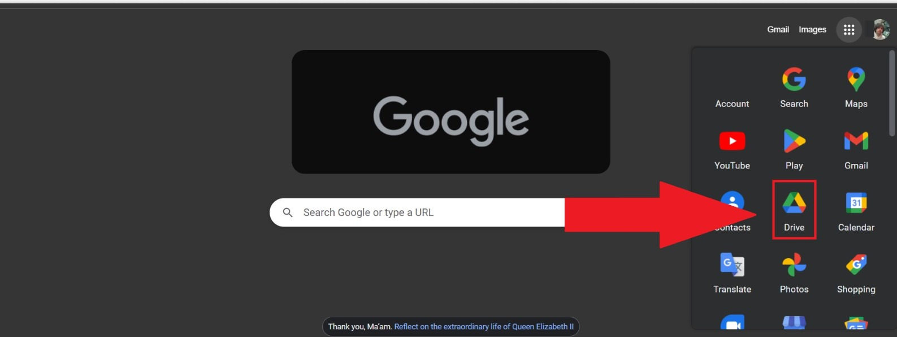
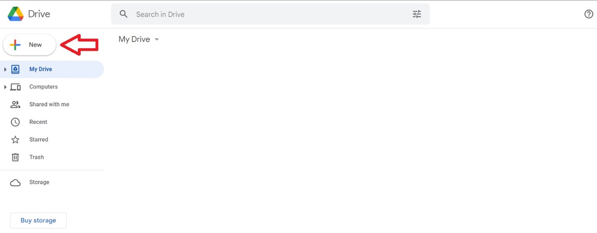
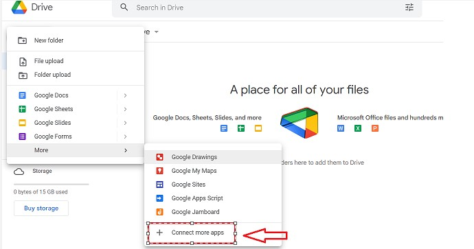
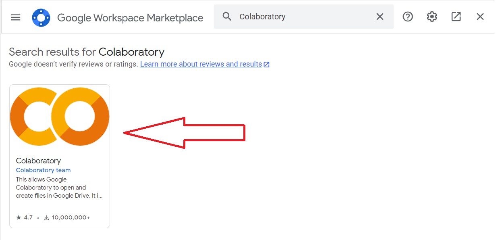
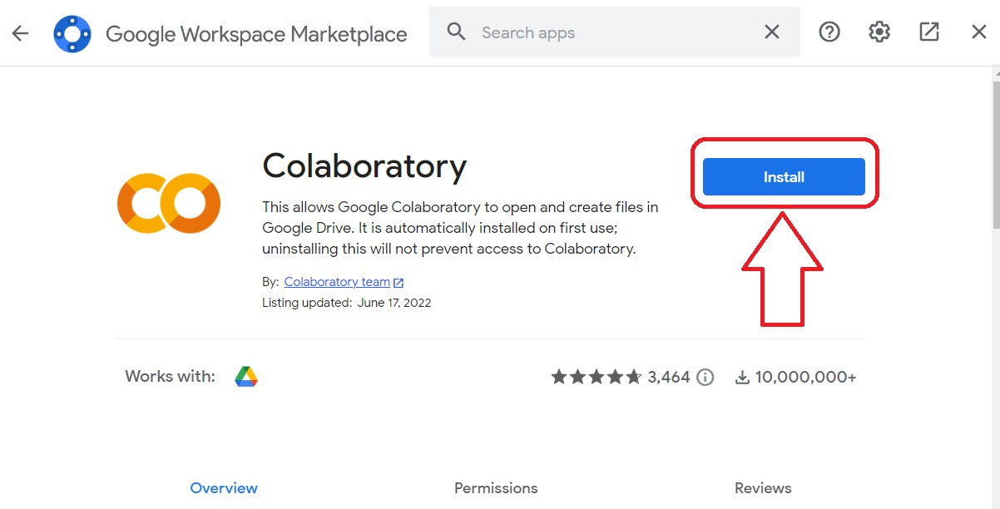
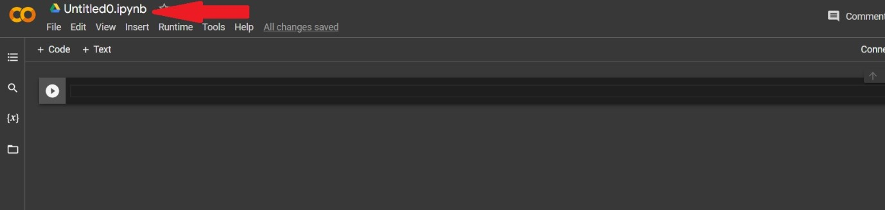
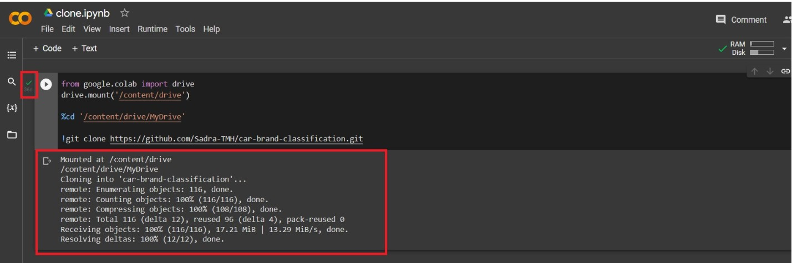

# car-brand-classification
The purpose of this notebook is to build a deep neural network and have it learn to classify images of 3 different car brands.<br>
There are multiple steps in the process that are explained in the notebook.<br>
The data used in the training and testing is scraped from web. They are only the front view of cars.<br>
A simple way of transfer learning is also applied to enhance the results.<br>

**Note that the notebook is made to run in Google Colab**<br>
so you should clone the repository in your google drive.

# Instruction to set up 
If you are not familiar with Google drive and Google colab, follow these instructions to set up the repository and have it ready to run.<br>

## Login to your google account and open your drive from the apps menu.


## When google drive is opened, click on the NEW button on the top left side of the screen


## Choose More and then choose Google Colaboratory from the list.


## If you don't see Google Colaboratory, you should install it in your drive first.
To do so, click on the **Connect more apps** option.


## When **Google Workspaces Marketplace** is opened, search for Google Colaboratory and click on it.


## Click on the install button and give permissions if asked for.


## Now you can go to the 3rd step and choose Colaboratory from the list.

## In the new tab that is opened, click on the name and change it to "clone" (Not necessary)


## Then copy the code below and paste it in the open cell.
```
from google.colab import drive
drive.mount('/content/drive')

%cd '/content/drive/MyDrive'

!git clone https://github.com/Sadra-TMH/car-brand-classification.git
```
It will mount Google Drive (give authentications if asked) and then change the directory to it. Then it will clone this repository in your drive.

## Click on the run button.
This will connect you to a runtime first and then run the cell.


## You should see an output such as picture bellow.


## You are all set!
Now you only need to navigate to the [car_brand_classification.ipynb](car_brand_classfication.ipynb) file in the cloned directory, open it and run the cells one by one.<br>
Don't worry, it has explanations too!
